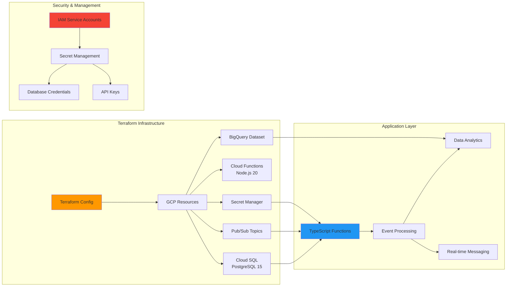
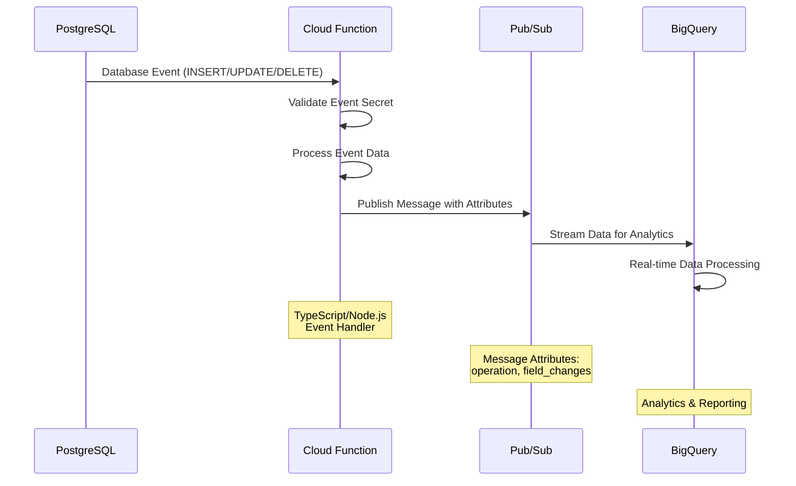
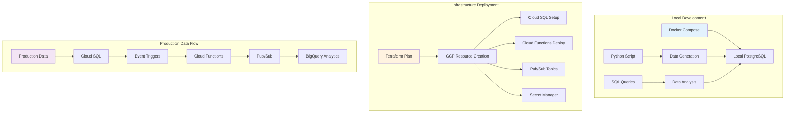

# PostgreSQL Data Simulation & Cloud Infrastructure Platform - Architecture

This document provides comprehensive architecture diagrams and technical details for the PostgreSQL Data Simulation & Cloud Infrastructure Platform.

## 1. Overall System Architecture

```mermaid
graph TB
    subgraph "Local Development"
        A[Python Data Generator<br/>populate.py] --> B[Docker PostgreSQL<br/>Local DB]
        B --> C[SQL Analysis Queries]
    end
    
    subgraph "Cloud Infrastructure (GCP)"
        D[Terraform Configuration] --> E[Google Cloud SQL<br/>PostgreSQL Instances]
        D --> F[Cloud Functions<br/>TypeScript/Node.js]
        D --> G[Pub/Sub Topics]
        D --> H[Secret Manager]
        D --> I[BigQuery Analytics]
        
        F --> G
        G --> I
        E --> F
        H --> E
        H --> F
    end
    
    subgraph "Data Flow"
        J[10M Users Generation] --> K[50M Records<br/>Emails & Phone Numbers]
        K --> L[9.27GB Database]
        L --> M[Real-time Analytics]
    end
    
    style A fill:#ff9999
    style D fill:#99ccff
    style F fill:#99ff99
    style E fill:#ffcc99
```



## 2. Database Schema & Data Distribution

```mermaid
erDiagram
    USERS {
        uuid id PK
        text name
    }
    
    EMAILS {
        uuid id PK
        uuid user_id FK
        text email UK
    }
    
    PHONE_NUMBERS {
        uuid id PK
        uuid user_id FK
        text phone_number UK
    }
    
    USERS ||--o{ EMAILS : "has"
    USERS ||--o{ PHONE_NUMBERS : "has"
    
    %% Data Distribution
    subgraph "Zipf Distribution"
        Z1[1 Email/Phone<br/>Most Users]
        Z2[2-3 Emails/Phones<br/>Many Users]
        Z3[4-5 Emails/Phones<br/>Few Users]
    end
```

## 3. Data Generation Process

```mermaid
flowchart TD
    A[Start: 10,000 Users] --> B[Generate User UUID]
    B --> C[Zipf Distribution<br/>Calculate Emails Count]
    C --> D[Zipf Distribution<br/>Calculate Phone Count]
    
    D --> E[Generate Emails<br/>user{id}_{n}@example.com]
    D --> F[Generate Phone Numbers<br/>16-digit nanoid]
    
    E --> G[Batch Insert<br/>10,000 records]
    F --> G
    G --> H[Commit Transaction]
    H --> I{More Users?}
    I -->|Yes| B
    I -->|No| J[Final: 10M Users<br/>50M Total Records]
    
    style A fill:#e1f5fe
    style J fill:#c8e6c9
```

## 4. Cloud Infrastructure Components



## 5. Event-Driven Data Processing



## 6. Development to Production Pipeline



## Technical Specifications

### Database Architecture
- **Database Engine**: PostgreSQL 15
- **Primary Keys**: UUID (uuid_generate_v4())
- **Data Volume**: 10M users, 50M total records
- **Database Size**: ~9.27GB
- **Distribution**: Zipf distribution for realistic data patterns

### Cloud Infrastructure
- **Platform**: Google Cloud Platform (GCP)
- **Infrastructure as Code**: Terraform
- **Compute**: Cloud Functions (Node.js 20)
- **Messaging**: Pub/Sub
- **Analytics**: BigQuery
- **Security**: Secret Manager, IAM

### Development Stack
- **Backend**: Python, TypeScript/Node.js
- **Containerization**: Docker
- **Database**: PostgreSQL with UUID extensions
- **Data Generation**: NumPy, Zipf distribution
- **Version Control**: Git

### Key Features
- **Scalable Data Generation**: Efficient batch processing
- **Real-time Event Processing**: Event-driven architecture
- **Cloud-Native Design**: Serverless functions and managed services
- **Security-First**: Secret management and IAM integration
- **Analytics Ready**: BigQuery integration for data analysis

## Performance Metrics
- **Data Generation**: 10,000 users per batch
- **Database Performance**: Optimized with UUID indexing
- **Cloud Function Response**: <60 seconds timeout
- **Event Processing**: Real-time with Pub/Sub
- **Infrastructure Deployment**: Automated with Terraform

This architecture demonstrates a modern, scalable approach to data simulation and cloud infrastructure management, suitable for enterprise-grade applications and large-scale data processing scenarios. 