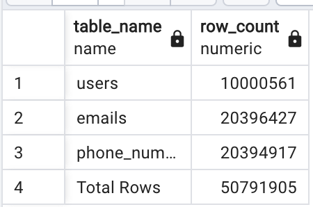
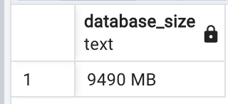
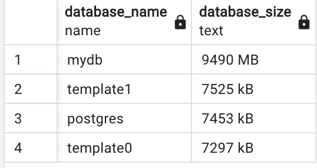
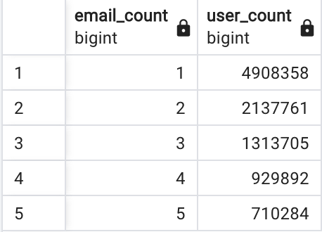

# PostgreSQL Data Simulation and Analysis

This project demonstrates how to set up a PostgreSQL database using Docker, populate it with simulated data using Python, and analyze it using SQL queries. The project includes instructions for setting up the environment, generating data, and performing insightful queries on the database.

---

## Setup Instructions

### 1. Start the PostgreSQL Database

Run the following command to start the PostgreSQL database using Docker:

```bash
docker compose up -d
```

---

### 2. Set Up the Python Environment

1. Create a virtual environment:

    ```bash
    python3.10 -m venv .venv
    source .venv/bin/activate
    ```

2. Install the required dependencies:

    ```bash
    pip install -r requirements.txt
    
    ```

---

### 3. Populate the Database

Run the Python script to generate and insert data into the database:

```bash
python populate.py

```

The script uses a combination of UUIDs and Zipf distribution to simulate a realistic dataset.

---

## SQL Queries for Analysis

### 1. Total Rows Across All Tables

This query retrieves the row count for each table and calculates the total number of rows across all tables:

```sql
SELECT
    table_name,
    table_rows AS row_count
FROM (
    SELECT
        relname AS table_name,
        n_live_tup AS table_rows
    FROM
        pg_stat_user_tables
) subquery
UNION ALL
SELECT
    'Total Rows' AS table_name,
    SUM(table_rows) AS row_count
FROM (
    SELECT
        n_live_tup AS table_rows
    FROM
        pg_stat_user_tables
) subquery;

```

**Output**:



---

### 2. Size of the Current Database

To get the size of the current database in a human-readable format:

```sql
sql
Copy code
SELECT pg_size_pretty(pg_database_size(current_database())) AS database_size;

```

**Output**:



---

### 3. Sizes of All Databases

To get the sizes of all databases on the PostgreSQL instance:

```sql
sql
Copy code
SELECT
    datname AS database_name,
    pg_size_pretty(pg_database_size(datname)) AS database_size
FROM
    pg_database
ORDER BY
    pg_database_size(datname) DESC;

```

**Output**:



---

### 4. Distribution of Emails per User

This query groups users by the number of emails they have and counts how many users fall into each group:

```sql
sql
Copy code
SELECT
    email_count,
    COUNT(*) AS user_count
FROM (
    SELECT user_id, COUNT(*) AS email_count
    FROM emails
    GROUP BY user_id
) subquery
GROUP BY email_count
ORDER BY email_count;

```

**Output**:



---

## Key Features of the Project

1. **UUID Usage**:
    - All primary keys (`users.id`, `emails.id`, `phone_numbers.id`) use UUIDs (`uuid_generate_v4()`), ensuring globally unique identifiers.
2. **Realistic Data Simulation**:
    - User emails and phone numbers are generated using Python and a Zipf distribution for a realistic distribution of data..
3. **Comprehensive Analysis**:
    - SQL queries provide insights into the structure and size of the database, as well as user behavior patterns (e.g., email distribution).
